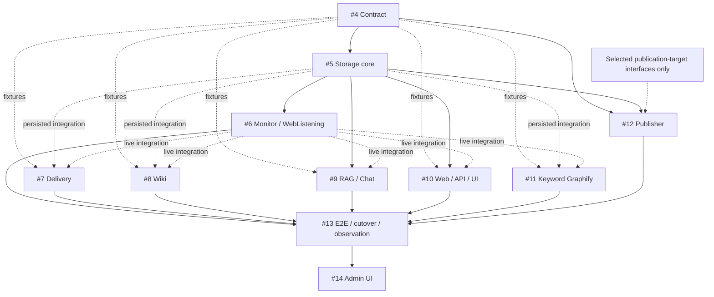
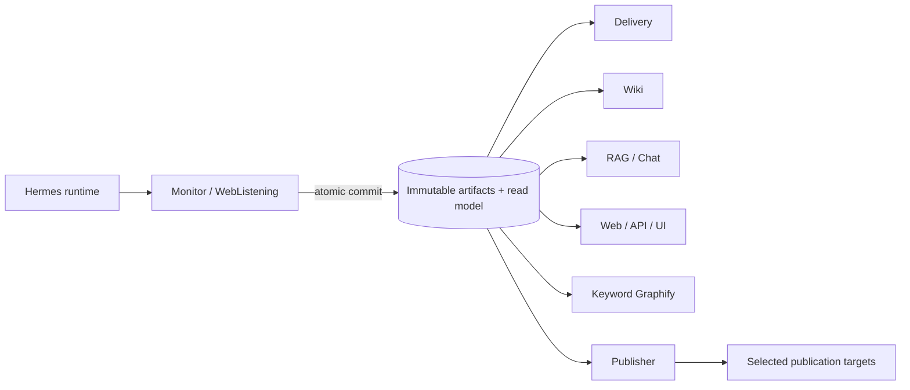

# Climate Monitor v2 migration plan

## 1. Strategy

Migration proceeds as a contract-first vertical slice, followed by independent consumers and a controlled operational cutover. Core business logic is completed and tested before Hermes production scheduling changes.

The minimum vertical slice is:

```text
Contract -> Storage -> Monitor/WebListening
```

It proves that Monitor can commit one validated, immutable canonical bundle with evidence, a deterministic Markdown projection, and a provenance receipt. Consumer work starts from frozen bundle fixtures and the stable slice rather than from legacy file formats.

## 2. Dependency and runtime maps

The first map shows implementation prerequisites. A solid arrow is a required prerequisite; a dotted arrow identifies fixture-driven or integration work that may proceed in parallel.



The second map shows runtime artifact flow. Monitor commits once to immutable storage; consumers read the same persisted bundle version independently.



Contract fixtures may unblock consumer scaffolding before the live Monitor is complete. Integration acceptance for every consumer still requires persisted bundles from the minimum vertical slice. Publisher work may begin against fixtures, but production promotion is gated by E2E and cutover approval.

## 3. Roadmap workstreams and gates

Numbering is presentation order. Delivery, Wiki, RAG/Chat, Web/API/UI, and Keyword Graphify may proceed in parallel once their stated fixture prerequisites are available.

### 1. Epic: Modular Canonical Pipeline v2

Track scope, architecture decisions, dependencies, risks, and the acceptance state of every child issue. Production completion requires a successful normal scheduled-run observation. If an actual rollback occurs, the epic remains open for bounded corrective work unless the owner explicitly approves abandonment with the rollback evidence preserved.

Before implementation PRs begin, record a reviewed legacy inventory: exact v1 commit(s), deployed-configuration evidence, known job behavior, source provenance for sanitized fixtures, the agreed Wiki baseline, and a migrate/project/archive/retire disposition for each legacy element.

### 2. Contract

Create `packages/report_contract` and `packages/artifact_protocol` with versioned schemas, semantic validation, canonical serialization, digest rules, artifact layout, receipt schema, types, and golden fixtures.

Acceptance gate:

- a complete valid fixture and representative invalid fixtures exist;
- bundle and projection digest vectors are stable across supported environments;
- article identity, dedupe, evidence, and receipt invariants are executable tests;
- compatibility/versioning policy is documented.

### 3. Storage

Implement the immutable persistence and read-model core of `modules/web_storage` using the artifact protocol. Support atomic commit, digest verification, idempotent replay, report lookup, run lookup, and evidence lookup.

Depends on: Contract.

Acceptance gate: a golden fixture can be committed, verified, retrieved, and recommitted without mutation or duplication.

### 4. Monitor/WebListening

Implement the repository-owned Monitor pipeline and a versioned WebListening port: collect, normalize, relevance, dedupe, final selection, deterministic statistics, one authoring pass, validate, project, and atomically store.

Depends on: Contract and Storage.

Acceptance gate: a fixed acquisition fixture and a controlled WebListening run both produce valid artifacts and receipts; replaying fixed inputs is deterministic outside the explicitly authored fields; no consumer or Hermes logic is embedded.

This closes the minimum vertical slice.

### 5. Delivery

Build bundle-only message/document projections and idempotent delivery receipts. Preserve approved recipient and presentation behavior without reading legacy Monitor/Wiki workspaces.

Depends on: Contract fixtures; integration depends on the minimum vertical slice.

### 6. Wiki

Preserve the Wiki as an independent whole and its agreed current structure. Replace its monitoring input with a versioned bundle importer/projector and retain Wiki-specific validation.

Depends on: Contract fixtures; integration depends on the minimum vertical slice.

Legacy Wiki code and content are migration/reference evidence only.

### 7. RAG/Chat

Build separate bundle/evidence indexing, retrieval, cited answering, and index provenance. Treat any Wiki corpus as explicitly secondary and attributable.

Depends on: Contract and Storage read APIs; integration depends on the minimum vertical slice.

### 8. Web/API/UI

Complete the API, access-control, and Web UI surfaces of the same `modules/web_storage` module, using the persistence/read-model core delivered by Storage. Storage and Web/API/UI are implementation increments of one module, not sibling services. Expose immutable artifacts and read-model views for history, detail, evidence, provenance, and operational status. Do not create alternate mutable report state.

Depends on: Storage and Contract; full report views depend on the minimum vertical slice.

### 9. Standalone Canonical Keyword Graphify

Build a deterministic, read-only graph projection from canonical per-article keywords and article identities. It must not read or modify Wiki content.

Depends on: Contract fixtures; integration depends on Storage and the minimum vertical slice.

### 10. Publisher adapter

Implement controlled, idempotent promotion of already validated artifacts. Verify digests and preconditions, record publication receipts, and keep approval/deployment policy explicit.

Depends on: Contract, Storage, and only the selected publication-target interfaces. RAG/Chat and unrelated consumers are not implicit prerequisites.

### 11. E2E/conformance, dual-run, cutover, rollback, and normal scheduled observation

Finish cross-module conformance and production-readiness work. This is where the Hermes adapter and production schedule are integrated; Hermes is not a prerequisite for core business logic.

Depends on: the minimum vertical slice and all consumers/adapters selected for initial cutover.

Acceptance requires the gates in sections 5-8 below.

### 12. Phase 2: Admin Prompt/Taxonomy UI

After v2 is stable, add an authenticated administrative UI for proposed prompt/taxonomy changes with validation, diff, review, versioning, and rollback. Runtime changes must still resolve to immutable repository/config versions referenced by receipts.

Depends on: successful v2 cutover and normal scheduled observation.

## 4. Legacy inventory and migration rules

Before implementation, record the exact old repository commit(s), deployed configuration evidence, sample artifacts, known job behavior, and Wiki structure used for comparison. Copy selected examples into sanitized, immutable test fixtures with source provenance.

Classify every legacy element as one of:

- **migrate** into a canonical bundle/evidence representation;
- **project** from canonical data into a consumer representation;
- **archive** as labeled legacy material;
- **retire** because it is obsolete or accidental coupling.

Do not classify anything as a permanent semantic fallback. After cutover, legacy formats are not queried to fill missing v2 fields.

## 5. Dual-run plan

Run v1 and v2 for the same controlled windows without allowing v2 to publish or deliver externally.

For each run:

1. Pin the old and new repository commits and all available configuration identities.
2. Capture acquisition windows and explain unavoidable differences in upstream results.
3. Compare normalized/final article sets, exclusion reasons, statistics, authored claims, citations, evidence availability, and consumer projections.
4. Classify differences as intentional contract changes, upstream variance, implementation defects, or legacy defects.
5. Require zero unexplained material differences before cutover approval.
6. Retain the comparison report and both provenance chains.

Dual-run is observational: it must not mutate production pointers, send duplicate delivery, or overwrite Wiki/Web publication state.

## 6. Cutover gates

Cutover is a separate, explicitly approved production change. Before approval:

- all selected contract and E2E suites pass from a clean environment;
- immutable storage backup/restore and digest verification are demonstrated;
- consumer idempotency is demonstrated;
- dual-run differences are accepted and documented;
- publisher dry-run and rollback drill succeed;
- production secrets, permissions, timeouts, resource limits, and logging are reviewed;
- the exact deployed commit and contract versions are recorded;
- the Hermes job contains only runtime/scheduler configuration and invokes the repository adapter;
- old scheduled writers are disabled in an order that prevents duplicate publication;
- an operator owns the observation window and rollback decision.

The production schedule must not be enabled or switched by a core implementation PR.

## 7. Rollback plan

Rollback restores operational pointers and schedules; it never edits an already committed canonical artifact.

Prepare and test:

- the last known-good deployed commit and configuration;
- old/new scheduler enable/disable steps with duplicate-run protection;
- immutable storage/read-model pointer restoration;
- consumer delivery and publication idempotency keys;
- database/index rebuild procedures from canonical artifacts;
- a decision threshold and named operator for rollback;
- an incident receipt that records what ran, what was published, and what was restored.

If v2 has published a valid immutable bundle before rollback, retain it with its status and provenance. Do not rewrite or delete it to imitate the old system.

The epic remains open until a normal scheduled observation succeeds. After an actual rollback, preserve and approve the evidence, then either retry through bounded corrective work or close the epic only through an explicit abandonment decision. A rolled-back deployment is not production-complete.

## 8. Normal scheduled observation

After cutover, keep the roadmap open through at least one normal scheduled cycle. Observe:

- Hermes started the exact approved commit and recorded job identity;
- Monitor produced one valid canonical bundle and receipt;
- evidence and artifact digests close correctly;
- each enabled consumer processed the same bundle version once;
- Delivery recipients and publication targets received no duplicates;
- Wiki structure and Web/API read models are healthy;
- RAG/Chat citations resolve to canonical identities/evidence;
- Keyword Graphify is reproducible and Wiki files are unchanged by its run;
- operational alerts, logs, latency, and resource use are within agreed thresholds.

Close the deployment issue only after the observation record is reviewed. If the cycle fails materially, execute the approved rollback or open a bounded corrective issue while preserving evidence.

## 9. Pull-request and approval workflow

- Use one focused feature branch and pull request per roadmap issue unless a reviewed issue explicitly defines a smaller stack.
- Require automated tests and at least one review for contract, storage, publisher, and deployment changes.
- Keep contract changes separate from consumer feature work when practical.
- Never merge destructive migrations, change production schedules, enable delivery, or execute cutover without explicit user/operator approval.
- Link every implementation PR to its roadmap issue and include exact verification evidence.
- Record deviations from this plan as reviewed decisions in `docs/planning/`.
